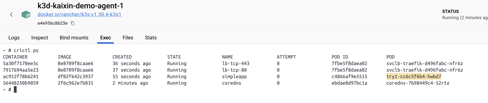

## registry setup

Using k3d registry for the local development cluster.

### create registry and cluster

> **_NOTE:_**  k3d add prefix *k3d* when creating resource

```bash
# Create a local registry
k3d registry create kaixin-registry --port 12345

# Create cluster with registry
k3d cluster create kaixin-demo --registry-use k3d-kaixin-registry:12345  --agents 2
```

### configure local DNS

Add the following entry to `/etc/hosts`:

```bash
127.0.0.1    kaixin-registry
```

### working with registry

1. Tag your local image:
```bash
docker tag simpleapp:v1.0 kaixin-registry:12345/simpleapp:v1.0
```

2. Push to registry:
```bash
docker push kaixin-registry:12345/simpleapp:v1.0
```

3. Verify registry contents:
```bash
curl kaixin-registry:12345/v2/_catalog
```

Expected response:
```json
{
    "repositories": ["simpleapp"]
}
```

## k8s command

### scale

```bash
kubectl create deployment try1 --image=k3d-kaixin-registry:12345/simpleapp:v1.0

kubectl scale deployment try1 --replicas=3
```

Verify container in k8s node.

```bash
crictl ps
```



### export yaml

```bash
kubectl get deployment try1 -o yaml > simpleapp.yaml
```

## probes

### liveness probe

1. command returns zero exit value.
2. http probe.
3. tcp probe.


```bash
for name in $(kubectl get pods -l app=try1 -o name); \
do kubectl exec $name -c simpleapp -- touch /tmp/healthy; done
```