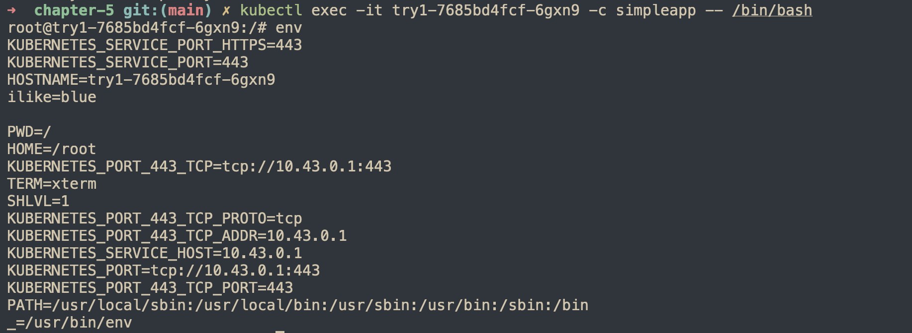

## configMaps

```bash
kubectl create configmap colors \
--from-literal=text=black \
--from-file=./favorite \
--from-file=./primary/

kubectl get configmap colors
```

Get env variables inside a container.
```
kubectl exec -it <pod_name> -c simpleapp -- env

PATH=/usr/local/sbin:/usr/local/bin:/usr/sbin:/usr/bin:/sbin:/bin
HOSTNAME=try1-68484d7ff9-q8g95
yellow=y

ilike=blue

black=k
known as key

cyan=c

favorite=blue

magenta=m

text=black
KUBERNETES_PORT_443_TCP_PORT=443
KUBERNETES_PORT_443_TCP_ADDR=10.43.0.1
KUBERNETES_SERVICE_HOST=10.43.0.1
KUBERNETES_SERVICE_PORT=443
KUBERNETES_SERVICE_PORT_HTTPS=443
KUBERNETES_PORT=tcp://10.43.0.1:443
KUBERNETES_PORT_443_TCP=tcp://10.43.0.1:443
KUBERNETES_PORT_443_TCP_PROTO=tcp
TERM=xterm
HOME=/root
```



## pv/pvc

```bash
kubectl apply -f pv.yaml
kubectl apply -f pvc.yaml
kubectl apply -f nginx.yaml
kubectl patch pv nfs-pv -p '{"spec":{"claimRef": null}}'
```


> **_NOTE:_** Why do we need the volumes section?<br>
The volumes section in the Pod spec acts as a bridge between the PVC (storage) and the containers inside the Pod. Kubernetes doesn't automatically attach storage just because a PVC exists—you must explicitly declare where and how the storage should be used in the pod.


```yaml
containers:
  - name: webcont
    image: nginx
    volumeMounts:
      - mountPath: "/var/log/nginx/"
        name: weblog-pv-storage  # Must match "volumes" name
  - name: fdlogger
    image: fluentd
    volumeMounts:
      - mountPath: "/var/log"
        name: weblog-pv-storage  # Must match "volumes" name
```

- This step actually mounts the volume inside the containers at the given paths (/var/log/nginx/ and /var/log).
- Without this, the storage won't be accessible inside the containers.

🔹 Why Not Just Use PVC Directly in volumeMounts?

Kubernetes separates storage definition from container usage for flexibility:

- Multiple containers in the same Pod can share the same volume (as in your example).
- The same PVC can be used in different Pods with different mount paths.
- You can mix different volume types (PVCs, ConfigMaps, Secrets, etc.).