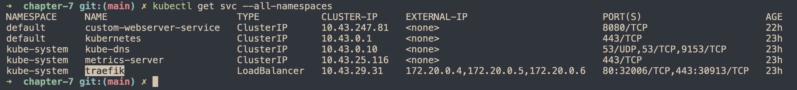

## ClusterIP

```bash
kubectl create deployment newserver --image=httpd
```

## NodePort

After creating a NodePort type service, we could access the nodeport on node which deploy k8s.

```bash
curl 127.0.0.1:32000
nslookup secondapp.default.svc.cluster.local
```


## Ingress

Show `ingress-controller`
```
kubectl get svc --all-namespaces
```



```bash
k3d cluster create --verbose --registry-use k3d-kaixin-registry:12345 -p "8081:80@loadbalancer" kaixin-demo --agents 2
kubectl apply -f ingress.yml
echo "127.0.0.1 kaixin.local" | sudo tee -a /etc/hosts
curl http://kaixin.local:8081
```

### What happen when running `kubectl apply -f ingress.yml`?

k8s add a new routing rule to traefik.


### Traffic flow


```
host -> lb container -> traefik service -> traefik pod (here is ingress) -> target backend service -> backend pod
```

## Iptables

```bash
iptables -t nat -L -n -v
```